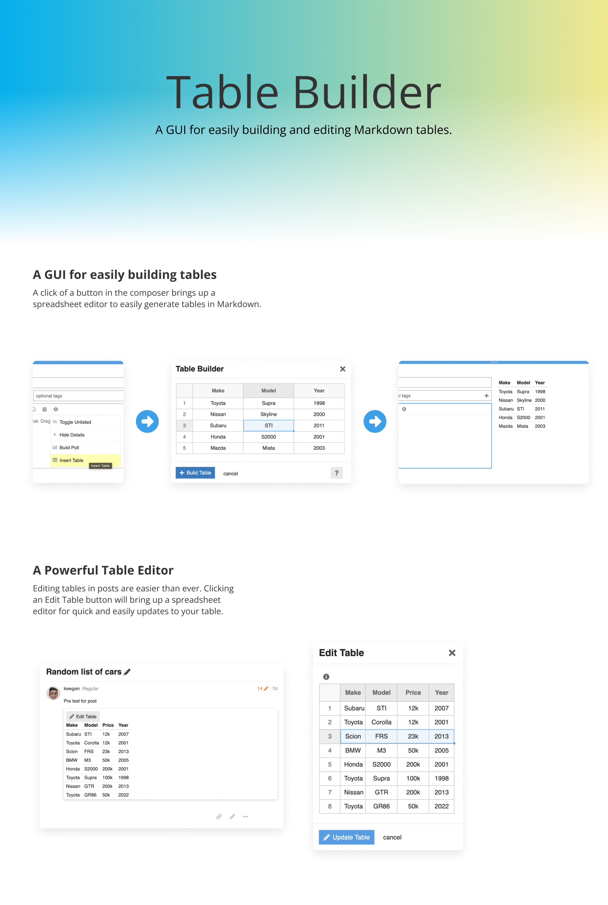

# Discourse Table Builder



A theme component that adds a button to the composer tools to easily build tables in markdown.

## To Do List

- [X] Add table builder functionality
- [ ] Possibly add the ability to edit tables
- [X] Add front-end tests

## Edit Table Functionality (WIP)

Known Issues:

- Clicking expand table button showing empty modal
- After viewing an edit table modal once, a reload is required for it to work again or with another table, otherwise the following error appears:
  
```js
 You need to pass a node argument to Importabular, like this : new Importabular({node: document.body})
```

This is possibly due to not having a unique id? Perhaps moving functionality to a component will resolve this.
